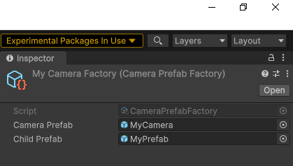

# Blender Render Engine for Unity MeshSync
This package streams rendered frames from Unity to Blender.

It's especially useful when combined with the [Unity MeshSync package](https://github.com/unity3d-jp/MeshSync) to see (in-game render) changes directly in Blender.

It can be challenging/impossible to match lighting and shading between Blender and Unity, this two-part solution makes sure that what's visible in Blender while editing is identical to in-game results.

Not affiliated with Unity.

# Contents
- [Requirements](#requirements)
- [Setup](#setup)
  - [Unity](#unity)
  - [Blender](#blender)
- [Usage \& Settings](#usage--settings)
  - [Quickstart](#quickstart)
  - [Blender Settings](#blender-settings)
  - [Unity Settings](#unity-settings)
    - [Camera Factory](#camera-factory)
- [Debug Logs](#debug-logs)
- [Limitations](#limitations)
- [Editor Refresh \& DLL Hooks \& Anti-Virus](#editor-refresh--dll-hooks--anti-virus)
- [Acknowledgments](#acknowledgments)

# Requirements
* Windows 10
* Unity 2023.1 or later
* Blender 3.3 or 3.4
* Other versions of all the above weren't tested but might still work
* MeshSync doesn't support Blender 3.5 yet, so this package doesn't either

# Setup
##  Unity
* Install this package [from its git URL](https://docs.unity3d.com/Manual/upm-ui-giturl.html) or [from a local copy](https://docs.unity3d.com/Manual/upm-ui-local.html)
* Install the [KlakSpout package](https://github.com/keijiro/KlakSpout)
* Install the [MeshSync package](https://github.com/unity3d-jp/MeshSync)

## Blender
* In Unity, navigate to `Edit > Project Settings > MeshSync Render Engine`
* Click the `Open Blender Addons folder` button
* Find the `.zip` addon file that corresponds to your Blender version
* [Install](https://docs.blender.org/manual/en/latest/editors/preferences/addons.html) that `.zip` addon file in Blender
* In the addon's settings, click the `Install Dependencies` button
* Restart Blender
* Setup the [MeshSync Blender addon](https://docs.unity3d.com/Packages/com.unity.meshsync.dcc-plugins@0.17/manual/index.html)

# Usage & Settings

## Quickstart
* Configure a MeshSync server in Unity
* In Blender:
  * Navigate to the `Tools` tab
  * Expand `MeshSync`
  * Expand `Scene`
  * Click `AutoSync`
  * Navigate to the `Render Properties` tab
  * Set `Unity` as the `Render Engine`
  * Set the `Viewport Shading` to `Rendered`

## Blender Settings
The settings are in the `Tools` tab, just underneath the MeshSync settings:

When `Auto-Connect` is enabled MeshSync Render Engine will connect and disconnect when MeshSync connects or disconnects. This avoids having to manage the two connections separately.

## Unity Settings
The settings are in `Edit > Project Settings > MeshSync Render Engine`:

### Camera Factory

Assign a `Camera Factory` to configure the stream camera, ex to set a specific anti-aliasing mode. When none is assigned a default factory is used.

A utility `Camera Prefab Factory` is also provided (`Create > MeshSync Render Engine > Camera Prefab Factory`). It copies the camera settings from a specified prefab and (optionally) instantiates a specified child prefab onto the GameObject:

Alternatively a custom factory can be coded by inheriting from `CameraFactory.cs`.

# Debug Logs
Logging in Unity can be configured in `Window > MeshSync Render Engine > Health Monitor`:

The `Show GameObjects` setting is particularly useful: it allows to inspect the otherwise hidden temporary objects added to the scene that implement the offscreen rendering and streaming.

Logging in Blender can be configured in the addon settings:

# Limitations
* A server (Unity instance) supports no more than one client
* The server and the client need to be on the same machine
    * Since we're using [Spout](https://github.com/leadedge/Spout2) under the hood
    * Video streaming would be nice but would need considerable effort
* Windows-only (Spout) at the moment, could use Syphon for Mac support

# Editor Refresh & DLL Hooks & Anti-Virus
Normally the Unity editor stops rendering when it's in the background. This is an issue because it prevents Unity from sending frames to Blender.

The current solution is to make the Unity editor think that it's always in the foreground while this package is actively streaming to Blender.

This is done by hooking the [`GetForegroundWindow`](https://learn.microsoft.com/en-us/windows/win32/api/winuser/nf-winuser-getforegroundwindow) function at the DLL level using the Detours library. This works like a charm but it can trip some anti-virus software.

# Acknowledgments
* [KlakSpout Unity package](https://github.com/keijiro/KlakSpout) by [Keijiro](https://www.keijiro.tokyo)
* [SpoutGL for Python](https://github.com/jlai/Python-SpoutGL) by [jlai](https://github.com/jlai)
* [Detours library](https://github.com/microsoft/Detours) by Microsoft
